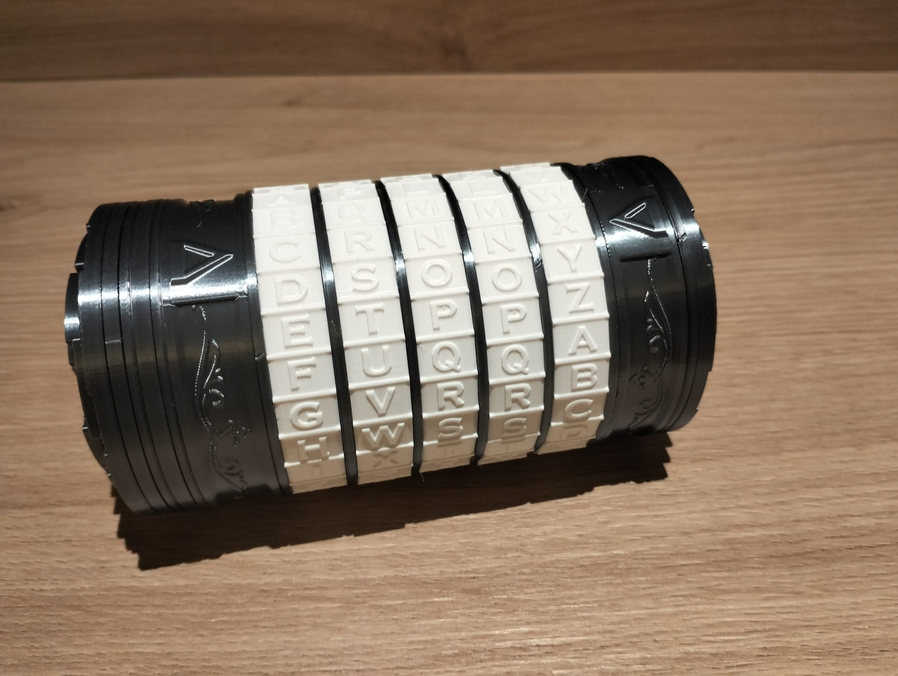

## Overview

In the past few days I've been at this year's CISPA (Helmholtz Center for Information Security) Summer School on Privacy-Preserving Cryptography. In the last day, there was a "crypto challenge", for which there were only 2 solves, one of them from my team: me and two friends from about:blankets - Giacomo and Eugenio. (picture of the prize in the end^^)

### Description:

The main goal of the challenge was to implement the ROS (**R**andom inhomogeneities in an **O**verdetermined **S**olvable system of linear equations) attack to forge Schnorr’s blind signatures, and therefore break unforgeability. This attack is well explained in [this paper](https://eprint.iacr.org/2020/945.pdf). The paper already includes an implementation of the attack, but in the addictive notation. Our generator implied implementing the attack on a multiplicative notation. 

### Source

The server we were attacking ran the following code:

```python

#!/usr/bin/env python

import hashlib
import random
import argparse
from http.server import HTTPServer, BaseHTTPRequestHandler

#secret seed for Signer
secret = "Password that will change for the challenge"

#Group from 2.3 https://datatracker.ietf.org/doc/html/rfc5114#section-2.3
p = int("87A8E61DB4B6663CFFBBD19C651959998CEEF608660DD0F25D2CEED4435E3B00E00DF8F1D61957D4FAF7DF4561B2AA3016C3D91134096FAA3BF4296D830E9A7C209E0C6497517ABD5A8A9D306BCF67ED91F9E6725B4758C022E0B1EF4275BF7B6C5BFC11D45F9088B941F54EB1E59BB8BC39A0BF12307F5C4FDB70C581B23F76B63ACAE1CAA6B7902D52526735488A0EF13C6D9A51BFA4AB3AD8347796524D8EF6A167B5A41825D967E144E5140564251CCACB83E6B486F6B3CA3F7971506026C0B857F689962856DED4010ABD0BE621C3A3960A54E710C375F26375D7014103A4B54330C198AF126116D2276E11715F693877FAD7EF09CADB094AE91E1A1597",16)
g = int("3FB32C9B73134D0B2E77506660EDBD484CA7B18F21EF205407F4793A1A0BA12510DBC15077BE463FFF4FED4AAC0BB555BE3A6C1B0C6B47B1BC3773BF7E8C6F62901228F8C28CBB18A55AE31341000A650196F931C77A57F2DDF463E5E9EC144B777DE62AAAB8A8628AC376D282D6ED3864E67982428EBC831D14348F6F2F9193B5045AF2767164E1DFC967C1FB3F2E55A4BD1BFFE83B9C80D052B985D182EA0ADB2A3B7313D3FE14C8484B1E052588B9B7D2BBD2DF016199ECD06E1557CD0915B3353BBB64E0EC377FD028370DF92B52C7891428CDC67EB6184B523D1DB246C32F63078490F00EF8D647D148D47954515E2327CFEF98C582664B4C0F6CC41659",16)
q = int("8CF83642A709A097B447997640129DA299B1A47D1EB3750BA308B0FE64F5FBD3",16)

#hash for Schnorr with SHA256
def hash(commitment,stringMessage):
    com = commitment.to_bytes(256, 'big')
    m = bytearray(stringMessage.encode('utf-8'))
    byteArrayData = com + m
    return int(hashlib.sha256(byteArrayData).hexdigest(),16)%q

#hash to Key
def hashToKey(sessionID):
    sec = bytearray(secret.encode('utf-8'))
    m = bytearray(sessionID.encode('utf-8'))
    byteArrayData = sec + m
    return int(hashlib.sha256(byteArrayData).hexdigest(),16)%q

def keyGen():
    sk = (random.getrandbits(256+128)) % q
    pk = pow(g,sk,p)
    return [sk,pk]
    
def keyGenFromSID(keyID):
    sk = hashToKey(str(keyID))
    pk = pow(g,sk,p)
    return [sk,pk]
    
def PKFromSID(keyID):
    sk = hashToKey(str(keyID))
    pk = pow(g,sk,p)
    return pk
    
#Schnorr with SHA256
def Sign(sk,m):
    (r,R) = keyGen()    #generater Schnorr commitment
    c = hash(R,m)
    s = (sk*c + r)%q
    return [c,s]
    
#Schnorr verification
def Verify(pk,sigma,m):
    c = sigma[0]
    s = sigma[1]
    R = (pow(g,s,p) * pow(pk,-c,p)) % p
    d = hash(R,m)
    return d==c
    
    
### Blind Schnorr Implementation ###
def Sign1(keyID, counter):
    r = hashToKey(str(keyID)+":"+str(counter))
    R = pow(g,r,p)
    return R
    
def Sign2(keyID,counter,c):
    r = hashToKey(str(keyID)+":"+str(counter))
    sk = hashToKey(str(keyID))
    s = (sk*c + r)%q
    return s
    
def round1(kid):
    keyID = str(kid)
    if not(keyID in sess):
        sess[keyID] = 0
    counter = sess[keyID]
    R = Sign1(keyID, counter)
    sess[keyID] = sess[keyID]+1
    ssess[keyID+":"+str(counter)] = 0
    return [hex(PKFromSID(keyID)),counter,hex(R)]

def round2(kid,counter,chall):
    keyID = str(kid)
    entry = keyID+":"+str(counter)
    if not(entry in ssess):
        return [0,"Session not opened"]
    if ssess[entry] == 1:
        return [0,"Closed Session"]
    c = int(chall,16) % q
    s = Sign2(keyID,counter,c)
    ssess[keyID+":"+str(counter)] = 1
    if not( keyID in ssess):
        ssess[keyID] = 1
    else:
        ssess[keyID] = ssess[keyID] + 1
    return [1,hex(s)]

### Winning condition ###

def verifySignatures(sid,signatures):
    keyID = str(sid)
    pk = PKFromSID(keyID)
    valid = True
    sigArr = signatures.split("-")
    messages = set()
    for sig in sigArr:
        m = sig.split("_")[0]
        messages.add(m)
        c = int(sig.split("_")[1],16) % q
        s = int(sig.split("_")[2],16) % q
        sigma = [c,s]
        if not Verify(pk,sigma,m):
            valid = False
            return "Invalid signatures"
    if not(keyID in ssess):
        ssess[keyID] = 0
    forgery = (ssess[keyID] < len(messages))
    if (valid and forgery):
        print("Winner")
        return hex(keyGenFromSID(keyID)[0])
    return "Not a forgery (not enough signatures)"
    
### Server Impl ###
def getArgs(postData):
    dict = {}
    argz = postData.split("&")
    for i in argz:
        dict[i.split("=")[0]] = i.split("=")[1]
    return dict

class S(BaseHTTPRequestHandler):
    def _set_headers(self):
        self.send_response(200)
        self.send_header("Content-type", "text/html")
        self.end_headers()

    def _html(self, message):
        """This just generates an HTML document that includes `message`
        in the body. Override, or re-write this do do more interesting stuff.

        """
        content = f"{message}"
        return content.encode("utf8")  # NOTE: must return a bytes object!

    def do_GET(self):
        self._set_headers()
        self.wfile.write(self._html("Hi! Use POST"))

    def do_HEAD(self):
        self._set_headers()

    def do_POST(self):
        content_length = int(self.headers['Content-Length']) # <--- Gets the size of data
        post_data = self.rfile.read(content_length) # <--- Gets the data itself
        pd = post_data.decode("utf-8")   # <-------- ADD this line
        argz = getArgs(pd)
        if not("fun" in argz):
            self._set_headers()
            self.wfile.write(self._html("Bad Request"))
            return
        if not("kid" in argz):
            self._set_headers()
            self.wfile.write(self._html("Bad Request"))
            return
        if argz["fun"] == "Sign1":
            [pk,sid,R] = round1(argz["kid"])
            resp = "pk="+str(pk)+"\nsid="+str(sid)+"\nR="+str(R)
            print("[Opened session] keyId: "+str(argz["kid"])+", sid: "+str(sid))
        elif argz["fun"] == "Sign2":
            if not("chall" in argz):
                self._set_headers()
                self.wfile.write(self._html("Bad Request"))
                return
            resp = round2(argz["kid"],argz["sid"],argz["chall"])
            if resp[0]==0: ##error
                resp = resp[1]
            else:   ##correct s
                resp = "s= " + str(resp[1])
                print("[Closed session] keyId: "+str(argz["kid"])+", sid: "+str(argz["sid"]))
        elif argz["fun"] == "Verify":
            if not("signatures" in argz):
                self._set_headers()
                self.wfile.write(self._html("Bad Request"))
                return
            resp = verifySignatures(argz["kid"],argz["signatures"])
            print("[Verification check] keyId: "+str(argz["kid"]) )
        self._set_headers()
        self.wfile.write(self._html(resp))

def run(server_class=HTTPServer, handler_class=S, addr="localhost", port=8000):
    server_address = (addr, port)
    httpd = server_class(server_address, handler_class)

    print(f"Starting httpd server on {addr}:{port}")
    httpd.serve_forever()

if __name__ == "__main__":
    sess = {}
    ssess = {}
    parser = argparse.ArgumentParser(description="Run a simple HTTP server")
    parser.add_argument(
        "-l",
        "--listen",
        default="localhost",
        help="Specify the IP address on which the server listens",
    )
    parser.add_argument(
        "-p",
        "--port",
        type=int,
        default=8000,
        help="Specify the port on which the server listens",
    )
    args = parser.parse_args()
    run(addr=args.listen, port=args.port)

```

### The ROS problem

The ROS problem can be (roughly) interpreted in the following way:

$\ell$-ROS: Find $A \in \mathbb{F}_p^{(\ell+1) \times (\ell+1)}$ and $c \in \mathbb{F}_p^{(\ell+1)}$ such that $A \cdot c = 0$.

There are a few conditions to the last collumn of $A$ and vector $c$:

* Last collumn of $A$ generated by a random oracle
* Last collumn of $A$ depends on the first $\ell$ collumns of $A$ (linear combination) and $c_{\ell+1} = -1$
* Solution exists if, with $Q$ the number os queries to the oracle, $Q^{\ell +1} / p \geq 1$


### The attack

The attack and it's correctness are well explained in the [paper](https://eprint.iacr.org/2020/945.pdf) I mentioned above, to which I credit the theorical information on this post.

Roughly, the attack works in the following way:

1. Open $\ell$ concurrent sessions and use `Sign1`to get $R_1, \dots. R_n$

2. Use the ROS attack to solve the $\ell$-ROS problem relative to $H(\prod_{i=1}^{\ell}R_i^{a_i}, m)$

3. Return part of the ROS solution $c = (c_1, \dots, c_\ell)$ as the challenges for `Sign2`, and recieve the replies $s = (s_1, \dots, s_\ell)$

4. Construct $\ell + 1$ forgeries using the rest of the ROS solution:

* $$ c_i' = H(\prod_{j=1}^{\ell}R_j^{A_{i,j}}, m_i)$$

* $$ s_i' = \sum_{j=1}^{\ell}A_{i,j} \cdot s_j$$

### Solve Script

Our final sove script was the following:

```python

import requests
from Crypto.Util.number import *
from random import randint
from math import prod
import hashlib
import hashlib
import random

url = "http://127.0.0.1:8000"

sess = requests.Session()
r = sess.get(url)
print("Is the server up? (sanity check):", r.text)

#Group from 2.3 https://datatracker.ietf.org/doc/html/rfc5114#section-2.3
p = int("87A8E61DB4B6663CFFBBD19C651959998CEEF608660DD0F25D2CEED4435E3B00E00DF8F1D61957D4FAF7DF4561B2AA3016C3D91134096FAA3BF4296D830E9A7C209E0C6497517ABD5A8A9D306BCF67ED91F9E6725B4758C022E0B1EF4275BF7B6C5BFC11D45F9088B941F54EB1E59BB8BC39A0BF12307F5C4FDB70C581B23F76B63ACAE1CAA6B7902D52526735488A0EF13C6D9A51BFA4AB3AD8347796524D8EF6A167B5A41825D967E144E5140564251CCACB83E6B486F6B3CA3F7971506026C0B857F689962856DED4010ABD0BE621C3A3960A54E710C375F26375D7014103A4B54330C198AF126116D2276E11715F693877FAD7EF09CADB094AE91E1A1597",16)
g = int("3FB32C9B73134D0B2E77506660EDBD484CA7B18F21EF205407F4793A1A0BA12510DBC15077BE463FFF4FED4AAC0BB555BE3A6C1B0C6B47B1BC3773BF7E8C6F62901228F8C28CBB18A55AE31341000A650196F931C77A57F2DDF463E5E9EC144B777DE62AAAB8A8628AC376D282D6ED3864E67982428EBC831D14348F6F2F9193B5045AF2767164E1DFC967C1FB3F2E55A4BD1BFFE83B9C80D052B985D182EA0ADB2A3B7313D3FE14C8484B1E052588B9B7D2BBD2DF016199ECD06E1557CD0915B3353BBB64E0EC377FD028370DF92B52C7891428CDC67EB6184B523D1DB246C32F63078490F00EF8D647D148D47954515E2327CFEF98C582664B4C0F6CC41659",16)
q = int("8CF83642A709A097B447997640129DA299B1A47D1EB3750BA308B0FE64F5FBD3",16)

#hash for Schnorr with SHA256
def hash(commitment,stringMessage):
    com = commitment.to_bytes(256, 'big')
    m = bytearray(stringMessage.encode('utf-8'))
    byteArrayData = com + m
    return int(hashlib.sha256(byteArrayData).hexdigest(),16) % q

def sign1(kid):
    print('running sign1')
    data = {"fun": "Sign1", "kid": str(kid)}
    res = sess.post(url, data)
    res = res.text.split('\n')
    pk = int(res[0].split('=')[-1],16)
    sid = int(res[1].split('=')[-1],16)
    R = int(res[2].split('=')[-1],16)
    return pk, sid, R

def sign2(kid, sid, chall):
    print('running sign2')
    data = {"fun": "Sign2", "kid": str(kid), "sid": str(sid), "chall": hex(chall)}
    res = sess.post(url, data)
    res = res.text
    s = int(res.split('=')[-1],16)
    return s

def verify(kid, msg,c,s):
    print('running verify')
    total = ''
    for msg1, c1, s1 in zip(msg,c,s):
        total += msg1 + '_' + hex(c1) + '_' + hex(s1) + '-'
    data = {"fun": "Verify", "kid": str(kid), "signatures": total[:-1]}
    res = sess.post(url, data)
    return res.text

# we needed a random kip each session, so.. 
kid = bytes_to_long(b'CISPA')+(randint(1,q))


ell = 520
messages = [f'message{i}' for i in range(ell)] + ['forgedmessage']
R = []

for i in range(ell):
    pk, sid, R1 = sign1(kid)
    R.append(R1)
    print(i)
# same session, same public key for each sign
X = pk

# we deffine 2 inner products, depending if we are operating with exponents or coefficients
def inner_product_multiply(coefficients, values):
    return prod(pow(y,x,p) for x, y in zip(coefficients, values)) % p
def inner_product_sum(coefficients, values):
    return sum(y*x for x, y in zip(coefficients, values)) % q

alpha = [[randint(1,q), randint(1,q)] for i in range(ell)]
beta = [randint(1, q) for i in range(ell)]
blinded_R = [[R[i] * pow(g, alpha[i][b], p) * pow(X, beta[i], p) % p for b in range(2)] for i in range(ell)]
c = [[hash(blinded_R[i][b], messages[i]) for b in range(2)] for i in range(ell)]
P = ([-sum([2**i * c[i][0] * pow(c[i][1] - c[i][0], -1, q) % q for i in range(ell)])] + [2**i * pow(c[i][1] - c[i][0], -1, q) % q for i in range(ell)])
c_to_decompose = hash(inner_product_multiply(P[1:], R), messages[ell])
bits = [int(b) for b in bin((c_to_decompose - sum([a*b for a, b in zip(P[1:], beta)]) + P[0]) % q)[2:].zfill(256)][::-1] 
bits +=  [0 for _ in range(len(bits),ell)]
blinded_c = [c[i][b] + beta[i] for (i, b) in enumerate(bits)]

s = []
for i in range(ell):
    s.append(sign2(kid, i, blinded_c[i]))
    print(i)

forged_signatures = [(blinded_R[i][bits[i]] % p, (s[i] + alpha[i][bits[i]]) % q) for i in range(ell)]
forged_signatures += [(inner_product_multiply(P[1:],R), inner_product_sum(P[1:],s))]
cl = hash(forged_signatures[-1][0], messages[-1])
c = [c[i][b] for (i, b) in enumerate(bits)] + [int(cl)]
print(verify(kid,messages,c,[forged_signatures[i][1] for i in range(len(messages))]))

```


### Last Remarks

I had a great experience at the Summer School, and really enjoyed the challenge.
Here is a picture of the prize for solving the challenge, a cryptex:



