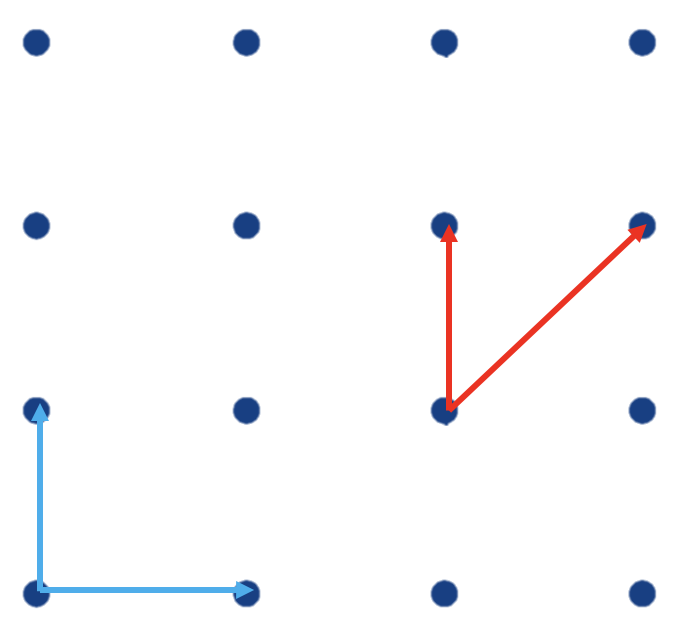
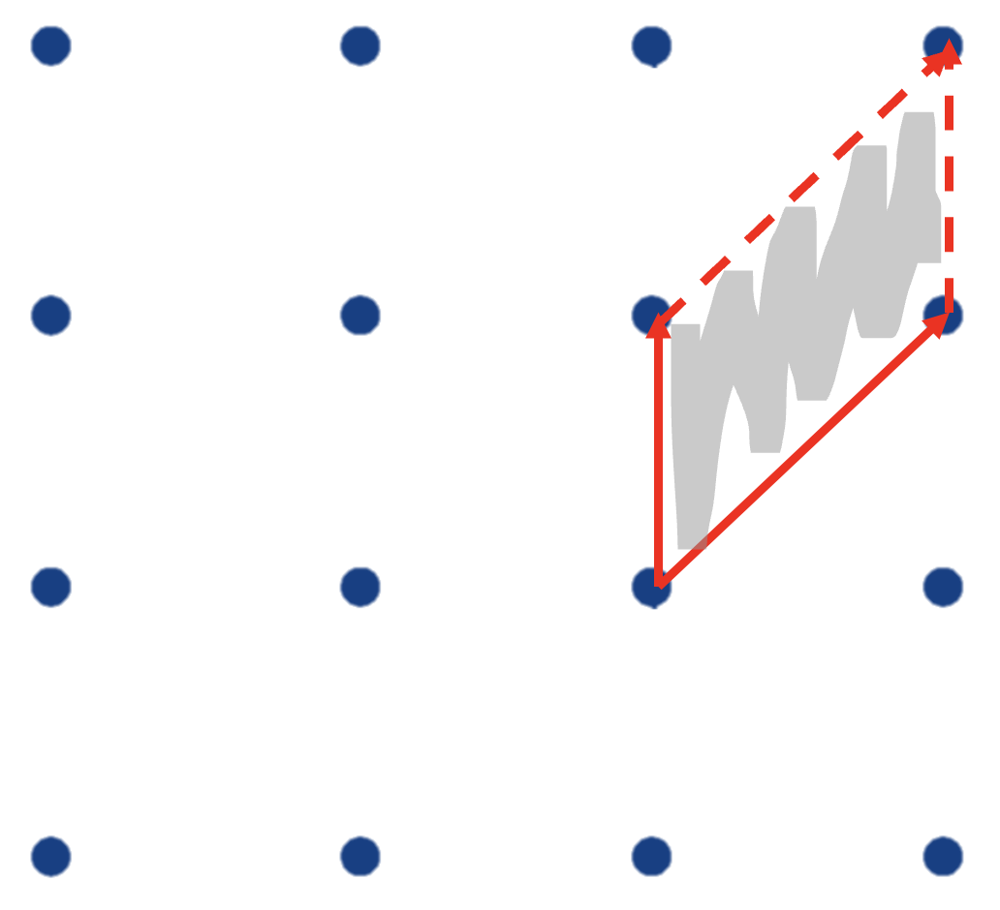

`This is the first of a series of posts on lattice-based cryptography.`

## Lattices?

This first post will be a small introduction. In the following posts, I plan to write in more depth about lattice reductions, tricks, problems and post quantum, among others. 

## Background

A **lattice** of dimension $n$ is a discrete addictive subgroup of $\mathbb{R}$. It is described by a basis $B$ of lineary independent vectors $\{ b_1, b_2, ..., b_n \}$ with $b_i \in \mathbb{R}^n$. The number of vectors in the basis $m$ is the rank of the lattice. 

The lattice $\mathcal{L}$ is then the integer linear combinations of the basis vectors: $\mathcal{L} = \{ \sum_{i=1}^{m} a_i b_i \text{ | } a_i \in \mathbb{Z} \}$ 

Note that the basis of a lattice is not unique:




## Properties

We've seen that, given two sets of vectors, they are basis for the same lattice if generate exactly every point in the lattice. As the lattice dimension increases, it's basis can then come in many different shapes. It is then natural to wonder how to efficiently distinguish whether two particular basis span the same lattice. To solve this problem, we must look for *invariants*.

The **fundamental parallelepiped** is a single *enclosed region* defined as: $\mathcal{P} = \{ \sum_{i=1}^{m} a_i b_i \text{ | } a_i \in [0,1) \}$.




Why is it important? Because $|det(\mathcal{L})| = vol(\mathcal{P}) = |det(B)|$, and here's our invariant! Note that the volume of the fundamental parallelepiped is independent of the basis **B**. Another useful result is the following:

**Theorem:** Let **B** and **B'** be basis. Then, $\mathcal{L}(B) = \mathcal{L}(B')$ iff $B = UB'$, for some integer matrix $U$ with $|det(U)| = 1$. The proof of this theorem is quite straighforward, writing the system as the matrix equation $B' = AB$ where $A$ is the coefficient matrix of this system of equations where each vector from $B'$ is written as an unique integer linear combination of the vectors of $B$. 

Another important invariant of a lattice is its **successive minima**. The first successive minimum $\lambda (\mathcal{L})$ of a lattice $\mathcal{L}$ is the length of it's shortest non-zero vector. In general, a lattice of rank $n$ has $n$ successive minima.

**Successive Minima** are defined as follows: Let $\mathcal{L}$  be a lattice of rank $n$. For $i \in \{1, ..., n\} $, the $i$-th successive minimum of $\mathcal{L}$, denoted by $\lambda_i (\mathcal{L})$, is the smallest $r$ such that $\mathcal{L}$ has $i$ linearly independent vectors of length at most $r$.
Geometrically,  $\lambda_i (\mathcal{L})$ is the radius of the smallest closed ball around the origin which contains $i$ linearly independent vectors.

There are no efficient methods to compute the successive minima of a lattice. Minkowski’s First Theorem establishes a bound for these values:

**Theorem:** Let $\mathcal{L}$ be a full-ranked $n$-dimensional lattice. Then: $\lambda_1 (\mathcal{L}) \leq \sqrt n |det(\mathcal{L})|^{\frac{1}{n}}$.

## Problems in Lattices

Some of the most important computational problems are lattice-based:

* **Shortest Vector Problem (SVP)**: Given a basis $ \mathbf{B} $ of a lattice $ \mathcal{L} = \mathcal{L}(\mathbf{B}) $, find a non-zero lattice vector $ \mathbf{v} $ that satisfies $ \|\mathbf{v}\| = \lambda_1(\mathcal{L}) $

* **Closest Vector Problem (CVP)**: Given a basis $ \mathbf{B} $ of a lattice $ \mathcal{L} = \mathcal{L}(\mathbf{B}) $, and a target vector $ \mathbf{t} $ (not necessarily in $ \mathcal{L} $), find a lattice vector $ \mathbf{v} $ that satisfies $ \|\mathbf{v} - \mathbf{t}\| = \min_{\mathbf{w} \in \mathcal{L}} \|\mathbf{w} - \mathbf{t}\| $.


These problems are **NP-hard**. For that reason, we define approximate versions, which have efficient solutions for certain parameters.

* **Approximate Shortest Vector Problem**: Given a basis $ \mathbf{B} $ of a lattice $ \mathcal{L} = \mathcal{L}(\mathbf{B}) $ and an approximation factor $ \gamma $, find a non-zero lattice vector $ \mathbf{v} $ that satisfies $ \|\mathbf{v}\| \leq \gamma \cdot \lambda_1(\mathcal{L}) $.

* **Approximate Closest Vector Problem**: Given a basis $ \mathbf{B} $ of a lattice $ \mathcal{L} = \mathcal{L}(\mathbf{B}) $, a target vector $ \mathbf{t} $ and an approximation factor $ \gamma $, find a lattice vector $ \mathbf{v} $ that satisfies $ \|\mathbf{v} - \mathbf{t}\| \leq \gamma \cdot \min_{\mathbf{w} \in \mathcal{L}} \|\mathbf{w} - \mathbf{t}\| $.

To solve these problems, we can use lattice reductions. 
The main idea is that we can transform an arbitrary lattice basis into a “better” basis, which contains shorter and more orthogonal vectors.

## LLL

**LLL** or **Lenstra–Lenstra–Lovász** is not only my favorite of this algorithms, but also the most used one in CTFs (or at least the one I've used the most). 

It runs in polynomial time, $ \mathcal{O}\left( n^6 \log^3 \|\mathbf{B}\|_\infty \right) $ and $ \|\mathbf{b}'_1\| \leq 2^{\frac{n-1}{2}} \lambda_1(\mathcal{L}) $. 

The intuition for the reduction is based on Gram Schmidt orthogonalization:

$
\mathbf{b}^*_i = 
\begin{cases} 
\mathbf{b}_i & \text{for } i = 1 \\
\mathbf{b}_i - \sum_{j=1}^{i-1} \mu_{i,j} \mathbf{b}^*_j & \text{for } 1 < i \leq n
\end{cases}
$

With $ \mu_{i,j} = \frac{\langle \mathbf{b}_i, \mathbf{b}^*_j \rangle}{\langle \mathbf{b}^*_j, \mathbf{b}^*_j \rangle} $.


Given a basis $B =\{b_1, ..., b_n\}$, we say that $B^* =\{b^*_1, ..., b^*_n\}$ is $\gamma$-LLL reduced, $\gamma \in (\frac{1}{4}, 1)$, if:


1. $ |\mu_{i,j}| \leq \frac{1}{2} $ for all $ i > j $ (size-reduced)
2. $ (\delta - \mu_{i+1,i}^2) \|\mathbf{b}^*_i\|^2 \leq \|\mathbf{b}^*_{i+1}\|^2 $ for all $ 1 \leq i \leq n - 1 $ (Lovász condition)

The first condition constrains the lengths of the basis vectors, but it does not guarantee that all basis vectors will be short.


The second condition addresses this issue by setting a more localized condition between consecutive Gram-Schmidt vectors. It essentially ensures that the second vector is not significantly shorter than the first.


## Other Lattice Reduction Algorithms

* **HKZ**, Hermite–Korkine–Zolotarev: Exponential time, $ \|\mathbf{b}'_1\| = \lambda_1(\mathcal{L}) $

* **BKZ**, Block (H)KZ: Parametrized by block size $ \beta $, Larger $ \beta $: slower, Smaller $ \beta $: worse basis

* Sieving and other costly approaches


## Why and when to use Lattices in CTF's?

Due to their structure and properties, lattices end up being massive destruction tools in CTF challenges. 

For instance, lattices and help break challenges that use:

* Biased PRNG
* Lost precision in your floating points calculations
* Wrong private RSA keys
* Solving Linear Modular equations with small solutions (e.g.m coppersmith)
* Knapsack 
* Low-density Subset Sum
* known LSB or MSB of RSA priv key
* LWE and other post-quantum implementations
* ... 

## Example: Solving a basic challenge

Let's take a look at a simple challenge, this time requiring only LLL and no other tricks.

~~~
Tan (ImaginaryCTF2023, maple3142): tan(x) is a broken hash function in terms of collision resistance and second preimage resistance. But you surely can't find the preimage of tan(flag), right?
~~~

The sorce code is really small:

```python

print(tan(int.from_bytes(open("flag.txt", "rb").read().strip(), "big")).n(1024))
# -0.7578486465144361653056740883647981074157721568235263947812770328593706155446273431983003083023944193451634501133844062222318380912228469321984711771640337084400211818130699382144693337133198331117688092846455855532799303682791981067718891947573941091671581719597626862194794682042719495503282817868258547714

```

It's not hard to figure out that this problem is about lost precision in floating points calculations.

Let the flag be $m$ and $tan(m)=c$.

Then, $\arctan(c) \approx m - k\pi \iff \arctan(c) + k\pi \approx m$

$m$ is an integer, so we can use LLL to minimize the decimal part of $\arctan(c)+k\pi$ and get the flag.

Writing the exploit in sage gives us the flag:

```python

bits = 1024
c = -0.7578486465144361653056740883647981074157721568235263947812770328593706155446273431983003083023944193451634501133844062222318380912228469321984711771640337084400211818130699382144693337133198331117688092846455855532799303682791981067718891947573941091671581719597626862194794682042719495503282817868258547714
arc = arctan(c)
pi_bits = pi.n(bits)

L = matrix(QQ, [[1* 2**bits, 0, 0], [arc* 2**bits, 1, arc], [pi_bits* 2**bits, 0, pi_bits]])
L = L.LLL()
m = abs(round(L[0][-1]))
assert tan(m).n(bits)==c
print(int(m).to_bytes((m.bit_length() + 7) // 8, "big"))

```

`b'ictf{can_you_break_sin_or_cos_too?}'`


## Other techniques and tricks

Like I said in the beginning, I plan to follow up with more writeups and posts about lattices in crypto. In the meantime, here are some tricks that can be used in more problems:

* weights
* CVP and Babai's algorithm
* Kannan embedding - Embed CVP into an SVP instance
* *flatter* - for more speed, namely in coppersmith
* enumeration - target is not always the shortest vector, check out my writeup for [Not New PRNG](https://ctf.l1z4rdq.com/posts/notnewprng_seccon22/) :)


## Last remarks

For now, here's a small introduction to lattices in crypto (mostly CTF this time). 

If you have any doubts and there's anything lattice-related topic or challenge you'd like to read about, feel free to [contact me](ctf@l1z4rdq.com)! 


### References

I first thought of writing some posts like this (and was inspired by) [Robin Jadoul's training](https://ur4ndom.dev/posts/2024-02-26-lattice-training/), which I was lucky to attend in person. 

[Joseph Surin and Shaanan Cohney's paper](https://eprint.iacr.org/2023/032.pdf) is also a pretty cool resource

