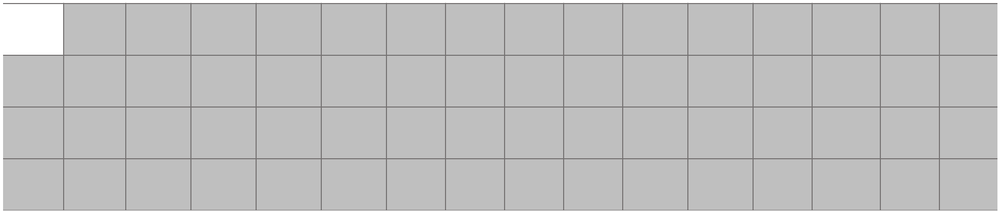
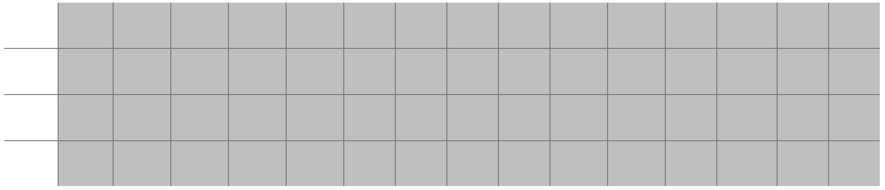
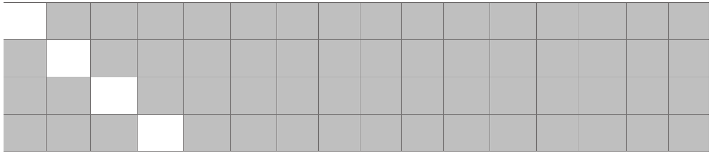
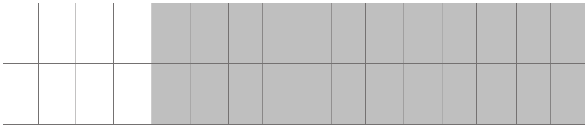
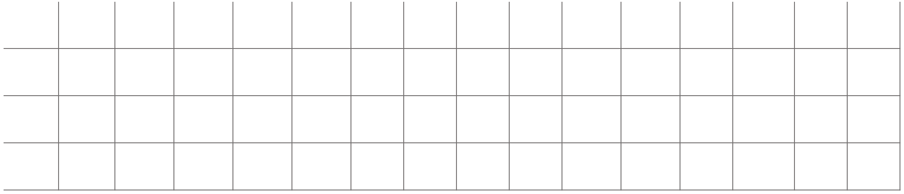
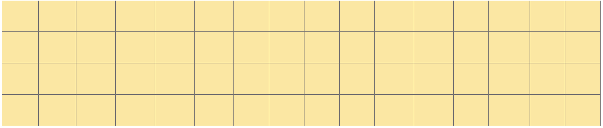

## Overview

This weekend me and my team played UMDCTF 24. We got 3rd place overall, 2nd place in the student division.
Two of the crypto challenges, `haes` and `haes2`, were based of a modified version of AES. It operated on a $4 \times 4 \times 4$ state matrix rather than the usual $4 \times 4$ state matrix of AES. However, many of the operations remained the same, making it vulnerable to the same types of attacks as AES. The attacks are pretty standard for block ciphers, so I decided to write this post as a walkthrough to this type of challenges and a deep dive into the Cryptanalysis of Block Ciphers.

### Given:

The sources of the challenges are in the CTF's github:
 - [haes](https://github.com/UMD-CSEC/UMDCTF-2024-Challenges/blob/main/crypto/haes/haes.py)
 - [haes2](https://github.com/UMD-CSEC/UMDCTF-2024-Challenges/blob/main/crypto/haes-2/haes_2.py)


### Code Analysis

Both challenges are adaptations of a [pure adaptation of AES](https://github.com/bozhu/AES-Python) to 64 bytes key and blocks. 
All the functions needed to implement the `decrypt` function are also already given:

```python

def decrypt(key, ciphertext):
    round_keys = expand_key(key)

    state = bytes_to_state(ciphertext)

    state = add_round_key(state, round_keys[N_ROUNDS])

    for i in range(N_ROUNDS-1, 0, -1):
        state = inv_shift_planes(state)
        state = inv_sub_bytes(state)
        state = add_round_key(state, round_keys[i])
        state = inv_mix_columns(state)


    state = inv_shift_planes(state)
    state = inv_sub_bytes(state)
    state = add_round_key(state, round_keys[0])

    return state_to_bytes(state)

```

The operations remained essentially the same as in standard AES, except for `shift_rows`, that was replaced by `shift_planes` in order to accomodate the extra dimension of the state matrix. 


### haes

This challenge uses `5` rounds AES. We were given 511 chosen plaintexts and the encrypted flag. 

The intended solution was, as confirmed by the author, `integral cryptanalysis`. The key idea for this kind of attacks is to sent a set of ciphertexts with a special property. If the property remains invariant through several rounds of the block cipher, then we have a way to distinguish whether or not a certain internal state is possible. If it persists all the way to the last `add_round_key` step, then can make deductions on the last round key's bytes based on whether XORing them with the ciphertexts gives a valid state.

We choose as initial set 256 ciphertexts which all differ in the first byte only. That first byte takes each of the 256 possible values in our set (sometimes referred to as a lambda-set). We call any byte position that takes every possible value an "active byte". To start, only the first byte is active - the rest are inactive, meaning bytes in that position are equal in our lambda-set.

First, let's look at the first round of (H)AES: `add_round_key -> sub_bytes -> shift_planes -> mix_columns -> add_round_key`.
Our $4 \times 4 \times 4$ state can be seen as a rubix cube. `shift planes` can then be seen as the row permutatio of a $16 \times 4$ array.

Therefore, in round 1, we have (active bytes in white):



`add_round_key` and `sub_bytes_steps` work byte-to-byte. Therefore, the activity/inactivity state of each byte remains invariant. `shift_planes` step fixes the first byte, mantaining the representation above.

However, `mix_columns` is more complicated. In general, mixing the first column makes all the bytes active in that column. 

Lastly, `add_round_key` preserves active/inactive bytes. Therefore, at the start of round 2 we have:



Round 2 consists of `sub_bytes -> shift_planes -> mix_columns -> add_round_key`. `sub_bytes` does nothing to our set, as seen before.

In `shift_planes`, our active bytes are now moved around. The bytes that were previously all in the same column are moved to a different column.



`mix_columns` turns our 4 active bytes into 16 and `add_round_key` preserves the state.



Round 3 is very similar to round 2, we end up with all 64 bytes being active after the 4th `add_round_key`.



In our set of 256 states, each byte position can now take all possible values. This is extremely unlikely to occur with random 256 plaintexts, suggesting that there's still some information left for us to use.

Looking into round 4, `sub_bytes` and `shift_planes` do nothing to our state, either since every byte is active. However, `mix_columns` mixes 4 active
bytes together, leading to inactive bytes. 
However, there is a weaker property that holds: the XOR-sum of the bytes in each position is still 0, since `mix_columns` is linear with respect to the XOR operation. Let's denote this property with the collor yellow.



The `add_round_key` operation still preserves our yellow bytes, so we can move onto the final round.

Round 5 consists of `sub_bytes -> shift_planes -> add_round_key`. The last `mix_columns` is omitted just like regular AES, since it turns out not to affect security.

The `sub_bytes` operation is not linear (it's the only AES operation that's not), so our yellow bytes lose their XOR-sum property. However, up until the final s-box, we have a way
to distinguish possible states from impossible states.

Let's work in the opposite direction: `add_round_key -> shift_planes -> sub_bytes`. First, there's an `add_round_key`, for which we'll need to guess each byte individually, since we don't have the key.
If we guess a round key byte, undo the `shift_planes` and `sub_bytes` operations on the corresponding byte position in our final set of ciphertexts, we can check the XOR-sum property.
If they XOR-sum to 0, our guess is possibly correct. If not, our guess is definitely incorrect, since we know that the bytes have the zero XOR-sum before the last s-box.

This way to filter key byte guesses gives us 1 to 4 possible round key bytes. Unfortunately, this multiplies up quickly in our scenario, since the round key is 64 bytes long. Luckily, if we mount the attack again, but this time with the second byte different rather than the first, we will get another set of guesses, and so we can just take the intersection to get almost always 1 guess per position.

After that, it's a matter of inverting the round key and getting the flag!

Check out the intended solve script [here](https://github.com/UMD-CSEC/UMDCTF-2024-Challenges/blob/main/crypto/haes/solve.py).


### haes 2

Let's see what changes from the other challenge:

```sh

~ diff haes.py haes_2.py

2d1
<
30c29
< N_ROUNDS = 5
---
> N_ROUNDS = 4 # NOTE THAT THIS IS DIFFERENT FROM THE OTHER CHALLENGE
225a225,226
>     print("The Baron has gotten tired of your long and meaningless messages.")
>     print("Be very careful about what you say.")
227c228,232
<     pt = bytes.fromhex(input())
---
>     pt = input()
>     if not pt.isprintable():
>         print("What is this meaningless garbage???")
>         exit()
>     pt = pt.encode()
231c236
<     elif (len(pt) // 64) >= 512:
---
>     elif (len(pt) // 64) > 3:


```

We can now send only 3 plaintexts and have only 4 rounds. In this case `differential cryptanalysis` seems to be the way to go.

Check out the intended solve script [here](https://github.com/UMD-CSEC/UMDCTF-2024-Challenges/blob/main/crypto/haes-2/solve.py).

(I'm working on a more detailed explanation for this challenge, will update soon, I hope)


## More on Cryptanalysis

While writing this post, I came across a few resourses on Block Ciphers Cryptanalysis that helped me understand this attack. I'd like to recommend the following:

- [Block Breakers](https://www.davidwong.fr/blockbreakers/index.html)
- [Author writeup](https://github.com/aparker314159/ctf-writeups/blob/main/UMDCTF2024AuthorWriteups/haes.md)
- [A cool paper usefull for haes2](https://eprint.iacr.org/2010/633.pdf)
- [Another cool paper](https://eprint.iacr.org/2022/487.pdf)